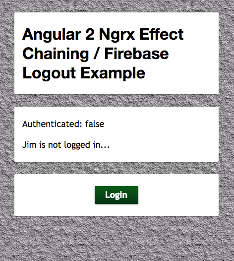
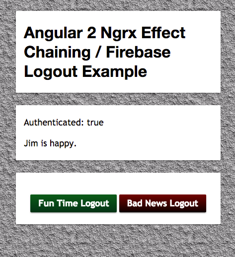
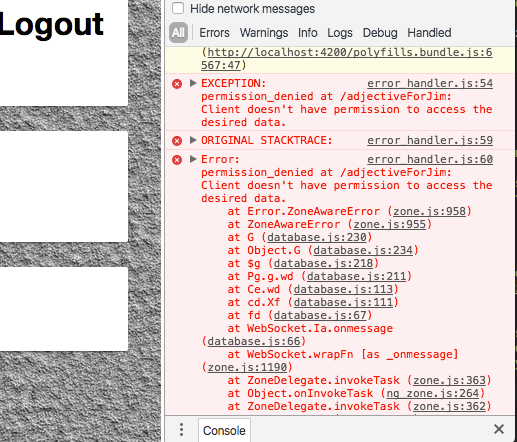
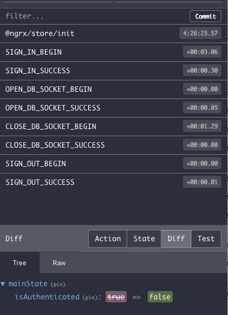

# Ngrx Effects Chaining Example

This repo is meant to demonstrate a few things:

* "Chaining" Ngrx Effects
* Canceling an Observable Stream in Ngrx
* Login / Logout of Firebase *without getting database errors.* 



This is a small and focused demo that begins with only a single button, the login button. Once it is clicked the user is anonymously authenticated through Firebase. Then the text in the middle card should update to display some text from the Firebase database. Once logged in, the user is presented with two other buttons.



The red button is the naiive logout approach which basically just calls the firebase logout method. I purposely put this in this project to demonstrate the problem with doing this. Since pulling from Firebase database is basically opening a websocket stream, signing out prevents you from acessing the stream and completely breaks the observable listening to the firebase database. If you have your debugging console open you should see a flood of red text when you click the red logout button.



On the other hand, the green button first closes the open Firebase database websocket. Then once that has finished the user is logged out. This makes for a very nice, error-free experience. ahhh, how refreshing.

## Effect Chaining

I'm a huge fan of Ngrx/store, a reactive Redux library for Angular 2. Of course, once you get into it you realize that you need Ngrx/effects for handling asynchronous events (or you should, at least)! I wanted a clean way of having various effects execute in a sequence. For example, when signing out I want to first close the Firebase database observable and then immediately after it finishes successfully sign out. 

Take a look at the three effects here:

```
@Effect()
  dbCloseSocket$ = this.action$
    .ofType(MainActionTypes.CLOSE_DB_SOCKET_BEGIN)
    .mergeMap((g) => {

      console.log('going: ');
      return Observable.of(this.dbSocket.$ref.off())
        .flatMap(payload => {
          // console.log('got this: ' + JSON.stringify(payload));
          return Observable.of(new CloseDbSocketSuccess())
        })
    });


  @Effect()
  closeDbSocketToSignOutChain$ = this.action$
    .ofType(MainActionTypes.CLOSE_DB_SOCKET_SUCCESS)
    .switchMap(() =>
      Observable.of(new SignOutBegin())
    );


  @Effect()
  signOut$ = this.action$
    .ofType(MainActionTypes.SIGN_OUT_BEGIN)
    .mergeMap((g) => {

      console.log('going: ');
      return Observable.fromPromise(this.af.auth.logout())
        .flatMap(payload => {
          return Observable.of(new SignOutSuccess())
        })

    });
```

The first, dbCloseSocket$, takes in a CLOSE_DB_SOCKET_BEGIN action, closes the websocket using "$ref.off()", and then returns an observable of the CLOSE_DB_SOCKET_SUCCESS action.

The third effect, signOut$, takes in a SIGN_OUT_BEGIN action, signs the user out with "af.auth.logout()", and then returns an observable of the SIGN_OUT_SUCCESS action.

**In general, effects that "do something" should always take in a "begin" action and should return a "success" (or "failure") action.**

I have found that this is the easiest approach for debugging, maintaining the codebase, and just figurign out what the heck is going on in an app where there's actions firing all over the place.

Notice that in the second effect there is no async event taking place and that it's "begin" action and "success" action don't match each other. This is what I call a "chaining effect", and I sometiems refer to it as an "empty effect" beacuse there is no interesting async stuff happening here. It literally just takes in the "CLOSE_DB_SOCKET_SUCCESS" action and returns a "SIGN_OUT_BEGIN" action. When writing our effects in this way we get a very nice "story" of the sequence of actions that are being fired off, and we can see these in the redux chrome extension:




## Usage

This project was generated with [angular-cli](https://github.com/angular/angular-cli) version 1.0.0-beta.28.3.

### Install Dependencies

`npm install`

### Development server
Run `ng serve` for a dev server. Navigate to `http://localhost:4200/`. The app will automatically reload if you change any of the source files.

### Code scaffolding

Run `ng generate component component-name` to generate a new component. You can also use `ng generate directive/pipe/service/class/module`.

### Build

Run `ng build` to build the project. The build artifacts will be stored in the `dist/` directory. Use the `-prod` flag for a production build.

## Running unit tests

Run `ng test` to execute the unit tests via [Karma](https://karma-runner.github.io).

### Running end-to-end tests

Run `ng e2e` to execute the end-to-end tests via [Protractor](http://www.protractortest.org/).
Before running the tests make sure you are serving the app via `ng serve`.

### Deploying to GitHub Pages

Run `ng github-pages:deploy` to deploy to GitHub Pages.

### Further help

To get more help on the `angular-cli` use `ng help` or go check out the [Angular-CLI README](https://github.com/angular/angular-cli/blob/master/README.md).

### Shoutouts 

* Thanks to Xavier Lozinguez for helping intitially me understand the quirks of Ngrx and being my only friend in NYC who loves Ngrx as much as I do.

* Also, big thanks to Andrew Woods for reading my blogs posts, for bringing the "Firebase logout while the socket's still open" issue into the light, and for updating me with his own code which was a huge inspiration for this project. Thanks, buddy.

### One More Thing
Not sure if it matters, but I'm using node v6.9.2, npm v3.10.9, and angular cli v1.0.0-beta.28.3

Cheers! 🍻 
-- Jimbo
